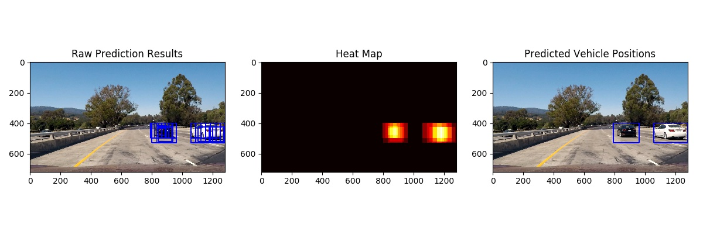
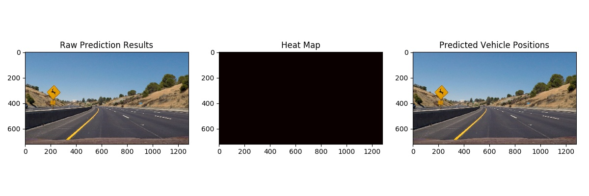

###Writeup / README

###Histogram of Oriented Gradients (HOG)

####1. Explain how (and identify where in your code) you extracted HOG features from the training images.

This HOG feature extraction code can be found in function `get_hog_features()` in lines #17-38 in `helper_funcs.py`. It is then called by function `extract_features_from_one_img()` in lines #65-118 in `helper_funcs.py`, which is eventually called by function `extract_features_from_multiple_imgs()` in lines #123-154 in `helper_funcs.py`, to process a sequence of image inputs for training.

For training, the `vehicle` and `non-vehicle` images are read in as two separate sets, as in lines #48-71 in `training.py`. Here is an example of one of each of the `vehicle` and `non-vehicle` classes:

Before extracting HOG feature, the image is converted from `RGB` color space to `YCrCb` space. Then HOG feature is extracted from all channels, examples can be found below. HOG features from all three channels are used for training.

Channel 0:

Channel 1:

Channel 2:

####2. Explain how you settled on your final choice of HOG parameters.

I tried various combinations of parameters and eventually chose `YCrCb` color space with:

orient = 9

pix_per_cell = 8

cell_per_block = 2

hog_channel = "ALL"

####3. Describe how (and identify where in your code) you trained a classifier using your selected HOG features (and color features if you used them).

I trained a linear SVM using all given vehicle and non-vehicle images, as in lines #98-101 in `train.py`, where the function `extract_features_from_multiple_imgs()` is called twice, one for vehicle images (lines #48-59) and non-vehicle images (lines #60-71). As mentioned above, the `extract_features_from_multiple_imgs()` calls function `extract_features_from_one_img()`, which is also defined in `helper_funcs.py` in lines #77-130 and contains the image feature extraction pipeline for training.

###Sliding Window Search

####1. Describe how (and identify where in your code) you implemented a sliding window search.  How did you decide what scales to search and how much to overlap windows?

Per the suggestion of the course, I used HOG sub-sampling window search approach. To test the trained model, I first extracted the HOG feature of the lower portion of the image and then applied sliding window on top of it. Code can be found in the function `vehicle_detection_pipeline()` at lines #89-153 in `vehicle_detection.py`.

I used 8x8 pixel blocks and windows with 8x8 blocks. Therefore each window has 64 pixels, which is identical to the original training image.

####2. Show some examples of test images to demonstrate how your pipeline is working.  What did you do to optimize the performance of your classifier?

Ultimately I used the following pipeline for vehicle detection (lines #15-179 in function `vehicle_detection_pipeline()` in `vehicle_detection.py`):
 
1. Crop out the lower portion of the image
2. Convert image from `RGB` to `YCrCb` color space 
3. Use scale of 1.5 to resize image/patches
4. Extract HOG features from all blocks and apply sliding window search (8x8 blocks per window) using HOG, Spatial and Histogram features for each window. 
5. Test the extracted features against trained model.

Here are a few examples:

---

### Video Implementation

####1. Provide a link to your final video output.  Your pipeline should perform reasonably well on the entire project video (somewhat wobbly or unstable bounding boxes are ok as long as you are identifying the vehicles most of the time with minimal false positives.)
Here's a [link to my video result](output_videos/project_video_output.mp4)

####2. Describe how (and identify where in your code) you implemented some kind of filter for false positives and some method for combining overlapping bounding boxes.

I used heatmap to process individual window detection results. By consolidating all positive  windows, I created a heatmap and then thresholded that map to identify vehicle positions.  I then used `scipy.ndimage.measurements.label()` to identify individual blobs in the heatmap.  I then assumed each blob corresponded to a vehicle.  I constructed bounding boxes to cover the area of each blob detected. The corresponding code can be found in lines #157-163 of function `vehicle_detection_pipeline()` in `vehicle_detection.py`.

Here's more example result showing the raw detection result/positive windows, the heatmap and the consolidated/labeled windows:

---

###Discussion

####1. Briefly discuss any problems / issues you faced in your implementation of this project.  Where will your pipeline likely fail?  What could you do to make it more robust?

The approach I took above costs non-trivial execution time for each frame. It might not be efficient enough for real-time application. 

One way to speed it up is to execute the sliding window search in parallel/on multiple CPU cores, since each window is in fact individually processed. 

Another way to boost accuracy/reduce false positive is to use a bigger and more sophisticated mask, with which the left, up and lower portion of the image can be removed therefore the remainder is faster to process.

If not considering the computing time, I might try more scaling factors to better detect vehicles a bit far away.